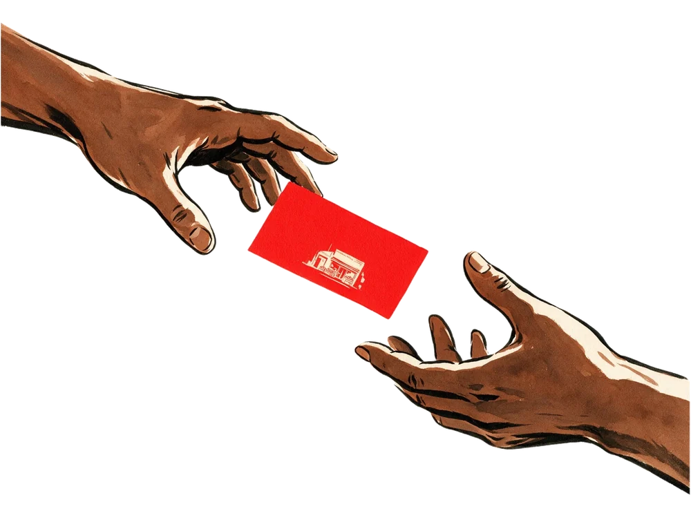

# Service plate illustrations — what to draw

Three cut-out figures, one per service panel. They sit on a cobalt
plate between the service name and its proposition, and they are
allowed to stand out of the top of that plate.

## Format

| | |
|---|---|
| **File** | `assets/svc-01.webp`, `svc-02.webp`, `svc-03.webp` |
| **Background** | Plain white is fine — the prepare script lifts it off. Do not place the art on cobalt yourself; the plate supplies that. |
| **Aspect** | Landscape or square. The script normalises everything to 4:3. |
| **Size** | 1500px or more on the long edge. |
| **Framing** | Draw the object, not a scene. It floats in the cobalt field, so it needs no ground, no backdrop and no vignette — a cast shadow on the paper is fine and keys out with it. |
| **Near-white inside the art** | Perfectly safe. The key only removes white that reaches the border, so a cream billboard face or the body of a machine survives intact. |

## Palette

Same world as the hero and the corner store:

- **Warm ivory `#FAF2E6`** and the flesh/terracotta range — this is what
  the figure is made of, and what separates it from the field.
- **Ink `#161310`** for line and shadow.
- **Signal red `#F21B16`** — at most one small element per figure, and
  only on the thing that acts. The plate already carries a red
  threshold along its base; do not compete with it.
- **Avoid cobalt in the figure.** It is the field. A cobalt figure
  disappears into it.

Same litho feel as the existing artwork: visible paper grain, slightly
mis-registered colour, confident line. Not flat vector, not 3D render,
not photography.

## The three subjects

Each should be a fragment of the STIR world rather than an icon of a
service — the same logic as the giant observer and the corner store.

**01 · Content & campaigns** — a camera light on a market corner. A
crew light or a phone on a gimbal raised over crates of produce. The
lit thing is an ordinary business, not a studio.

**02 · Brand & websites** — a shop window being lettered. A hand and a
brush painting a sign onto glass, mid-stroke. The business getting its
face.

**03 · Ongoing creative & growth** — the operator, mid-shift. A single
figure at a counter or a desk with the work visibly in motion around
them. Someone is in charge; that is the whole proposition.

## Dropping them in

Run the source file through the preparer, which keys out the paper,
trims to the art and normalises the ratio:

```
python3 scripts/prepare-illustration.py ~/art/press.jpg svc-03
```

Then point the panel at it:

```html
<div class="svc-plate" data-reveal="registration">
  <span class="svc-plate-no" aria-hidden="true">01</span>
  
  <i class="svc-plate-rule" aria-hidden="true"></i>
</div>
```

Keep `alt=""` — the figure is decorative; the service name and scope
carry the meaning. The plate number stays behind it: it is the empty
state and part of the composition both.

## What is in there now

| | Subject |
|---|---|
| **01 · Content & campaigns** | One hand passing a red card to another, the card carrying a storefront. A reason to act, handed over. |
| **02 · Brand & websites** | A hand painting the first red stroke onto a blank sign. The business getting its face. |
| **03 · Ongoing creative & growth** | A hand on the lever of a press, a storefront plate in the bed. Someone is running it. |
